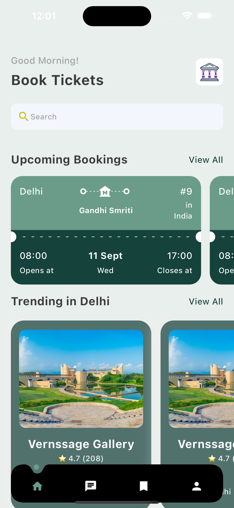
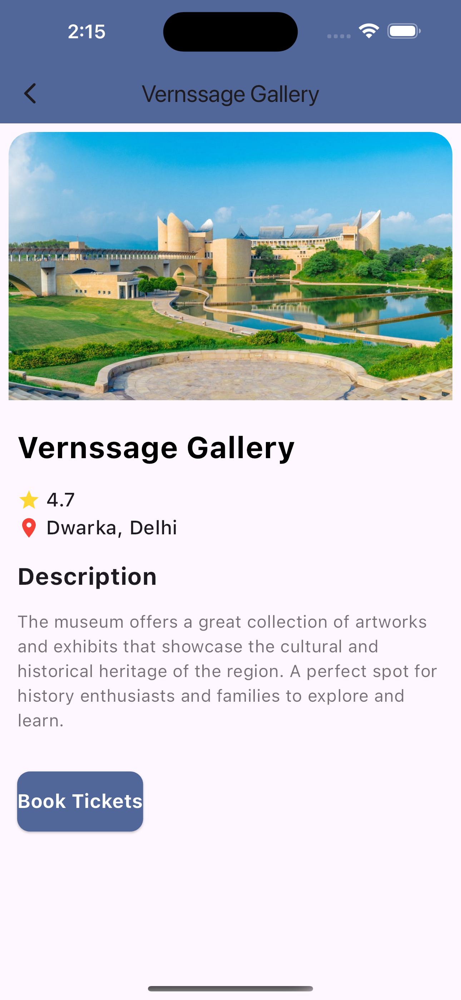
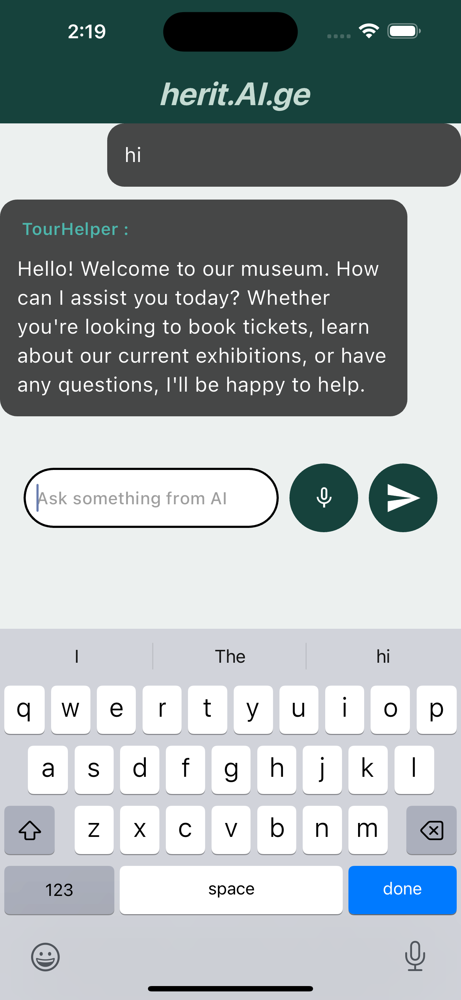
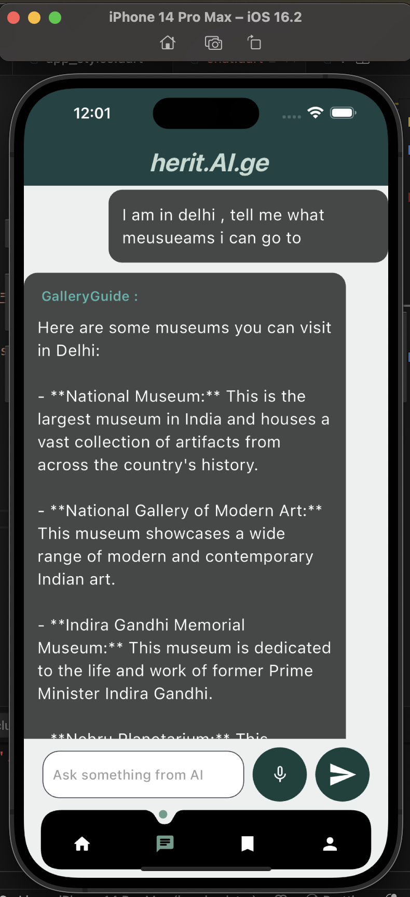
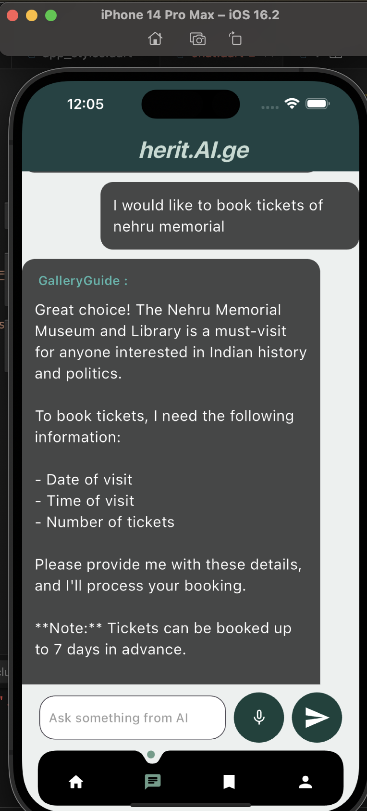
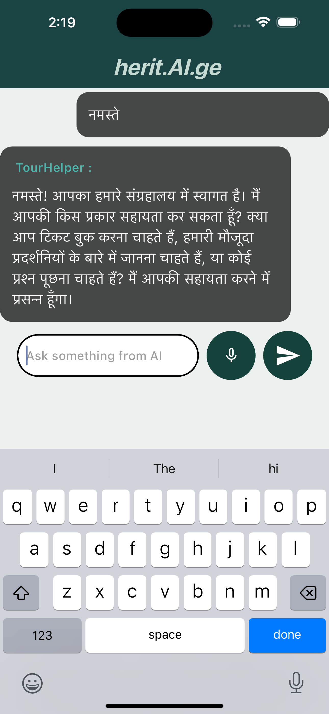
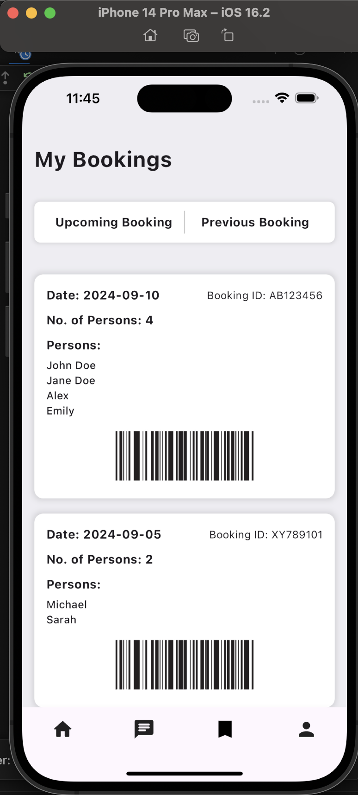
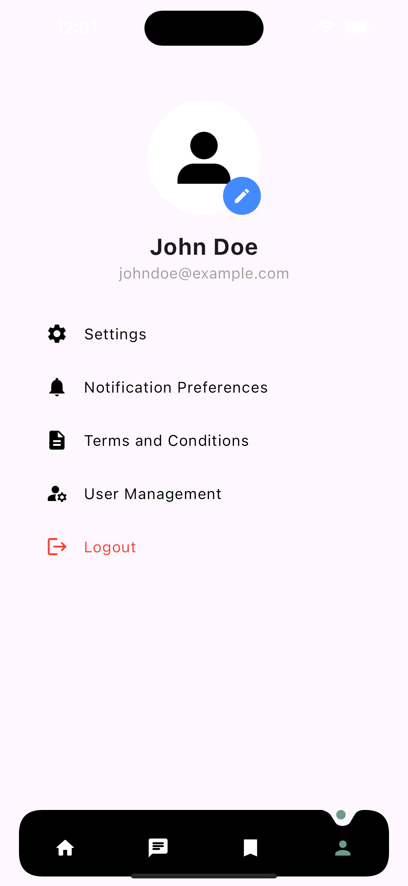

# Museum-Booking-App
This Museum Ticket Booking App is designed to provide a seamless and interactive experience for users looking to book tickets for various museums. This user-friendly app not only allows visitors to explore museums and exhibits but also integrates the power of an AI chatbot to assist users throughout the booking process.

**Key Features:**

- **AI Chatbot Assistance:** The app comes with an intelligent AI chatbot that helps users in booking tickets quickly and easily. The chatbot guides users through the booking process step-by-step and answers queries about the available museums and exhibits.
- **Multi-language Support:** To ensure accessibility for a diverse audience, the chatbot can communicate in multiple languages, offering a personalized experience to users worldwide.
- **Voice Input:** The app features a dedicated microphone option, allowing users to type or speak their queries. This makes the booking process even more convenient, especially when users prefer voice commands over typing.

# Screenshots

  
  
  
  
  
  
  
  

